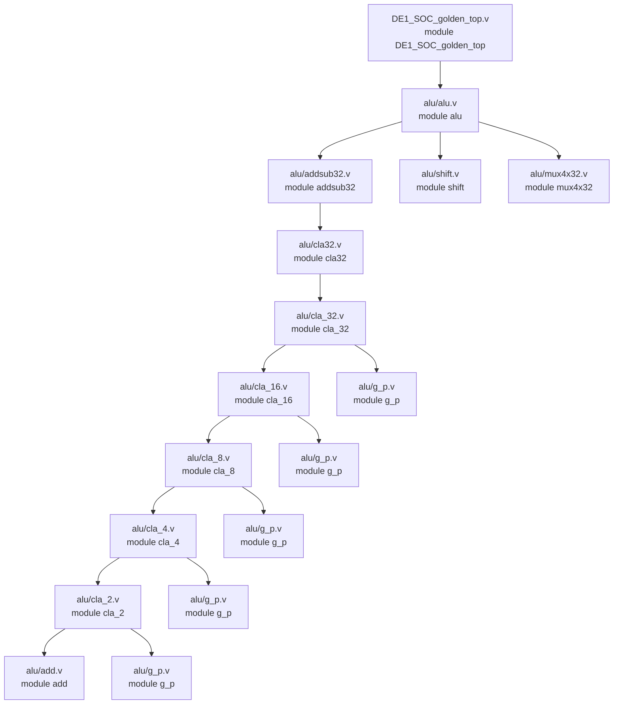

# Verilog源码逐文件讲解.md：提取版

> 本文件是检索中间材料，不是已核对的正式知识结论。

# Verilog 源码逐文件讲解

本文档逐个讲解当前仓库中的所有 `.v` 文件，并说明这些文件之间的调用关系。适合助教备课、课堂讲解，也适合学生对照源码理解整个 ALU 实验工程。

当前仓库一共有 16 个 `.v` 文件：

```text
DE1_SOC_golden_top.v
alu/alu.v
alu/alu_main.v
alu/addsub32.v
alu/cla32.v
alu/cla_32.v
alu/cla_16.v
alu/cla_8.v
alu/cla_4.v
alu/cla_2.v
alu/add.v
alu/g_p.v
alu/shift.v
alu/mux4x32.v
alu/mux2x32.v
alu/mux2x5.v
```

说明：`DE1_SOC_golden_top.qsf` 中还引用了 `alu/regfile.v` 和 `alu/dff32.v`，但当前文件夹中没有这两个文件，所以本文档不讲解这两个不存在的文件。

## 1. 文件调用关系总览

当前真正从顶层走到 ALU 结果的调用链如下：



还有 3 个文件需要特别说明：

| 文件 | 当前是否被顶层主链路使用 | 说明 |
| --- | --- | --- |
| `alu/alu_main.v` | 否 | 和 `alu.v` 功能几乎一样，但没有 `/*synthesis keep*/`，当前顶层没有例化它。 |
| `alu/mux2x32.v` | 否 | 通用 32 位 2 选 1 选择器，当前 `alu.v` 没有直接例化。 |
| `alu/mux2x5.v` | 否 | 通用 5 位 2 选 1 选择器，当前 `alu.v` 没有直接例化。 |

可以把整个工程理解成三层：

1. 板级顶层：`DE1_SOC_golden_top.v`，负责连接开发板时钟、按键、开关，并产生测试输入。
2. ALU 主体：`alu.v`，负责根据 `aluc` 选择加减、逻辑、LUI、移位等运算。
3. 基础功能模块：加减法器、CLA、移位器、多路选择器等。

## 2. `DE1_SOC_golden_top.v`

### 2.1 原代码

```verilog
// ============================================================================
// Copyright (c) 2013 by Terasic Technologies Inc.
// ============================================================================
//
// Permission:
//
//   Terasic grants permission to use and modify this code for use
//   in synthesis for all Terasic Development Boards and Altera Development
//   Kits made by Terasic.  Other use of this code, including the selling
//   ,duplication, or modification of any portion is strictly prohibited.
//
// Disclaimer:
//
//   This VHDL/Verilog or C/C++ source code is intended as a design reference
//   which illustrates how these types of functions can be implemented.
//   It is the user's responsibility to verify their design for
//   consistency and functionality through the use of formal
//   verification methods.  Terasic provides no warranty regarding the use
//   or functionality of this code.
//
// ============================================================================
//
//  Terasic Technologies Inc
//  9F., No.176, Sec.2, Gongdao 5th Rd, East Dist, Hsinchu City, 30070. Taiwan
//
//
//                     web: http://www.terasic.com/
//                     email: support@terasic.com
//
// ============================================================================
//Date:  Thu Jul 11 11:26:45 2013
// ============================================================================

//`define ENABLE_HPS

module DE1_SOC_golden_top(

      ///////// CLOCK2 /////////
      input              CLOCK2_50,

      ///////// CLOCK3 /////////
      input              CLOCK3_50,

      ///////// CLOCK4 /////////
      input              CLOCK4_50,

      ///////// CLOCK /////////
      input              CLOCK_50,


      ///////// HEX0 /////////
      output      [6:0]  HEX0,

      ///////// HEX1 /////////
      output      [6:0]  HEX1,

      ///////// HEX2 /////////
      output      [6:0]  HEX2,

      ///////// HEX3 /////////
      output      [6:0]  HEX3,

      ///////// HEX4 /////////
      output      [6:0]  HEX4,

      ///////// HEX5 /////////
      output      [6:0]  HEX5,

      ///////// KEY /////////
      input       [3:0]  KEY,

      ///////// LEDR /////////
      output      [9:0]  LEDR,


      ///////// SW /////////
      input       [9:0]  SW
);


//=======================================================
//  REG/WIRE declarations
//=======================================================

reg [31:0] pattern_a;
reg [31:0] pattern_b;


//=======================================================
//  Structural coding
//=======================================================

always @ (posedge CLOCK_50)
begin
   if(!KEY[0])
	  begin
	    pattern_a <= 32'h000_000a;
		 pattern_b <= 32'h000_000b;
	  end
	else
	  begin
	    if(SW[4]) // enable patten change
		   begin
	       pattern_a <= pattern_a + 32'h1;
		    pattern_b <= pattern_b + 32'h3;
			end
		 else  // patttern keep the same value
		   begin
	       pattern_a <= pattern_a;
		    pattern_b <= pattern_b;
			end
	  end
end


alu alu_inst(
 	/*input  [31:0] */    .a(pattern_a),
 	/*input  [31:0] */    .b(pattern_b),
	/*input  [3:0]  */    .aluc(SW[3:0]),
	/*output [31:0] */    .r(),
	/*output        */    .z()
	);


endmodule
```

### 2.2 文件作用

这是整个 Quartus 工程的顶层模块。`DE1_SOC_golden_top.qsf` 中设置的顶层实体就是 `DE1_SOC_golden_top`。

它主要做三件事：

1. 声明 DE1-SoC 开发板上的硬件端口，例如时钟、按键、开关、LED、数码管。
2. 用 `CLOCK_50`、`KEY[0]`、`SW[4]` 产生两个 32 位测试操作数 `pattern_a` 和 `pattern_b`。
3. 例化 `alu` 模块，把 `pattern_a`、`pattern_b` 和 `SW[3:0]` 送入 ALU。

### 2.3 端口讲解

| 端口 | 方向 | 位宽 | 当前实验作用 |
| --- | --- | --- | --- |
| `CLOCK_50` | 输入 | 1 | 核心时钟，驱动 `pattern_a` 和 `pattern_b` 更新。 |
| `CLOCK2_50`、`CLOCK3_50`、`CLOCK4_50` | 输入 | 1 | 模板保留端口，当前实验代码未使用。 |
| `KEY[3:0]` | 输入 | 4 | 当前只使用 `KEY[0]`，作为低有效复位。 |
| `SW[9:0]` | 输入 | 10 | 当前使用 `SW[3:0]` 作为 `aluc`，使用 `SW[4]` 控制测试数据是否变化。 |
| `LEDR[9:0]` | 输出 | 10 | 声明了但当前没有驱动 ALU 结果。 |
| `HEX0` 到 `HEX5` | 输出 | 每组 7 位 | 声明了但当前没有驱动 ALU 结果。 |

### 2.4 关键代码讲解

```verilog
reg [31:0] pattern_a;
reg [31:0] pattern_b;
```

这两个寄存器是 ALU 的测试输入。它们不是外部直接输入的 32 位数据，而是顶层内部产生的模式数据。

```verilog
always @ (posedge CLOCK_50)
```

表示这是同步时序逻辑，只有 `CLOCK_50` 上升沿到来时才更新寄存器。

```verilog
if(!KEY[0])
```

表示 `KEY[0]` 是低有效复位。按下按键时，`KEY[0]` 通常为 0，所以 `!KEY[0]` 为 1。

```verilog
pattern_a <= 32'h000_000a;
pattern_b <= 32'h000_000b;
```

复位时把两个输入固定为：

```text
pattern_a = 0x0000000A
pattern_b = 0x0000000B
```

```verilog
if(SW[4])
begin
    pattern_a <= pattern_a + 32'h1;
    pattern_b <= pattern_b + 32'h3;
end
```

松开复位后，如果 `SW[4]=1`，每个时钟周期：

```text
pattern_a 加 1
pattern_b 加 3
```

如果 `SW[4]=0`，两个寄存器保持不变。固定输入做实验时，建议保持 `SW[4]=0`。

```verilog
alu alu_inst(
    .a(pattern_a),
    .b(pattern_b),
    .aluc(SW[3:0]),
    .r(),
    .z()
);
```

这里例化 `alu` 模块：

- `a` 接 `pattern_a`。
- `b` 接 `pattern_b`。
- `aluc` 接 `SW[3:0]`。
- `r` 和 `z` 没有接到顶层输出。

这就是为什么本实验不能直接从 LED 或数码管看到 ALU 结果，必须用 SignalTap 看内部信号。

### 2.5 与其他文件的关系

`DE1_SOC_golden_top.v` 只直接调用一个自定义模块：

```text
alu/alu.v 中的 module alu
```

它是整个实验的板级包装层；真正的运算逻辑不在顶层，而在 `alu.v` 及其下级模块中。

## 3. `alu/alu.v`

### 3.1 原代码

```verilog
module alu(a,b,aluc,r,z);
	input  [31:0] a,b;
	input  [3:0] aluc;
	output [31:0] r;
	output z;
	wire [31:0] d_and = a & b;
	wire [31:0] d_or  = a | b;
	wire [31:0] d_xor = a ^ b;
	wire [31:0] d_lui = {b[15:0],16'h0};
	wire [31:0] d_and_or  = aluc[2]? d_or  : d_and;
	wire [31:0] d_xor_lui = aluc[2]? d_lui : d_xor;
	wire [31:0] d_as /*synthesis keep*/;
	wire [31:0] d_sh /*synthesis keep*/;
	addsub32 as32 (a,b,aluc[2],d_as);
	shift shifter (b,a[4:0],aluc[2],aluc[3],d_sh);
	mux4x32 select (d_as,d_and_or,d_xor_lui,d_sh,aluc[1:0],r);
	assign z = ~|r;
endmodule
```

### 3.2 文件作用

这是当前工程真正使用的 ALU 模块。它接收两个 32 位操作数 `a`、`b` 和 4 位控制码 `aluc`，输出 32 位结果 `r` 和零标志 `z`。

ALU 内部不是只算一种结果，而是并行构造多条候选结果通路：

| 信号 | 含义 |
| --- | --- |
| `d_as` | 加法或减法结果。 |
| `d_and_or` | AND 或 OR 结果。 |
| `d_xor_lui` | XOR 或 LUI 结果。 |
| `d_sh` | 移位结果。 |

最后用 `mux4x32` 根据 `aluc[1:0]` 选择其中一个作为 `r`。

### 3.3 端口讲解

| 端口 | 方向 | 位宽 | 含义 |
| --- | --- | --- | --- |
| `a` | 输入 | 32 | 第一个操作数。 |
| `b` | 输入 | 32 | 第二个操作数。 |
| `aluc` | 输入 | 4 | ALU 控制码。 |
| `r` | 输出 | 32 | ALU 最终结果。 |
| `z` | 输出 | 1 | 零标志，`r` 全 0 时为 1。 |

### 3.4 关键代码讲解

```verilog
wire [31:0] d_and = a & b;
wire [31:0] d_or  = a | b;
wire [31:0] d_xor = a ^ b;
```

这三行分别计算按位与、按位或、按位异或。它们都是 32 位组合逻辑。

```verilog
wire [31:0] d_lui = {b[15:0],16'h0};
```

这行实现 LUI 类似功能：把 `b` 的低 16 位放到结果高 16 位，低 16 位补 0。

```verilog
wire [31:0] d_and_or  = aluc[2]? d_or  : d_and;
wire [31:0] d_xor_lui = aluc[2]? d_lui : d_xor;
```

这里用 `aluc[2]` 在同一类通路中继续选择：

- `aluc[2]=0`：选择 AND 或 XOR。
- `aluc[2]=1`：选择 OR 或 LUI。

```verilog
wire [31:0] d_as /*synthesis keep*/;
wire [31:0] d_sh /*synthesis keep*/;
```

`d_as` 和 `d_sh` 是中间结果。`/*synthesis keep*/` 提示综合器保留这些信号，方便 SignalTap 观察。

```verilog
addsub32 as32 (a,b,aluc[2],d_as);
```

调用 `addsub32`：

- `a`、`b` 是操作数。
- `aluc[2]` 是 `sub` 控制位。
- `d_as` 是加法或减法结果。

```verilog
shift shifter (b,a[4:0],aluc[2],aluc[3],d_sh);
```

调用 `shift`：

- 被移位数据是 `b`。
- 移位位数是 `a[4:0]`。
- `aluc[2]` 控制左移或右移。
- `aluc[3]` 控制右移时逻辑右移或算术右移。

```verilog
mux4x32 select (d_as,d_and_or,d_xor_lui,d_sh,aluc[1:0],r);
```

最终 4 选 1：

| `aluc[1:0]` | 输出 |
| --- | --- |
| `00` | `d_as` |
| `01` | `d_and_or` |
| `10` | `d_xor_lui` |
| `11` | `d_sh` |

```verilog
assign z = ~|r;
```

`|r` 是归约或。只要 `r` 有任意一位为 1，`|r` 就为 1。取反后：

- `r=0` 时，`z=1`。
- `r!=0` 时，`z=0`。

### 3.5 与其他文件的关系

`alu.v` 直接调用：

```text
addsub32.v  -> 产生加减法结果 d_as
shift.v     -> 产生移位结果 d_sh
mux4x32.v   -> 选择最终输出 r
```

它是整个 ALU 数据通路的核心文件。

## 4. `alu/alu_main.v`

### 4.1 原代码

```verilog
module alu_main (a,b,aluc,r,z);
	input  [31:0] a,b;
	input  [3:0] aluc;
	output [31:0] r;
	output z;
	wire [31:0] d_and = a & b;
	wire [31:0] d_or  = a | b;
	wire [31:0] d_xor = a ^ b;
	wire [31:0] d_lui = {b[15:0],16'h0};
	wire [31:0] d_and_or  = aluc[2]? d_or  : d_and;
	wire [31:0] d_xor_lui = aluc[2]? d_lui : d_xor;
	wire [31:0] d_as,d_sh;
	addsub32 as32 (a,b,aluc[2],d_as);
	shift shifter (b,a[4:0],aluc[2],aluc[3],d_sh);
	mux4x32 select (d_as,d_and_or,d_xor_lui,d_sh,aluc[1:0],r);
	assign z = ~|r;
endmodule
```

### 4.2 文件作用

`alu_main.v` 与 `alu.v` 的逻辑基本相同，也实现同样的 ALU 功能。

两者的主要区别：

```verilog
// alu.v
wire [31:0] d_as /*synthesis keep*/;
wire [31:0] d_sh /*synthesis keep*/;

// alu_main.v
wire [31:0] d_as,d_sh;
```

`alu.v` 对 `d_as` 和 `d_sh` 加了 `synthesis keep`，更方便 SignalTap 观察中间信号；`alu_main.v` 没有这个属性。

### 4.3 当前是否使用

当前顶层 `DE1_SOC_golden_top.v` 中例化的是：

```verilog
alu alu_inst(...)
```

不是：

```verilog
alu_main ...
```

所以当前硬件主链路中没有使用 `alu_main.v`。它可以看作 `alu.v` 的对照版本或备用版本。

### 4.4 与其他文件的关系

如果它被使用，调用关系与 `alu.v` 一样：

```text
alu_main -> addsub32
alu_main -> shift
alu_main -> mux4x32
```

但当前工程顶层不调用它。

## 5. `alu/addsub32.v`

### 5.1 原代码

```verilog
module addsub32 (a, b, sub, s);
	input  [31:0] a, b;
    input         sub;
    output [31:0] s;
    cla32 as32 (a, b^{32{sub}}, sub, s);
endmodule
```

### 5.2 文件作用

`addsub32` 是 32 位加减法模块。它不单独写减法器，而是用同一个加法器 `cla32` 同时完成加法和减法。

### 5.3 端口讲解

| 端口 | 方向 | 位宽 | 含义 |
| --- | --- | --- | --- |
| `a` | 输入 | 32 | 第一个操作数。 |
| `b` | 输入 | 32 | 第二个操作数。 |
| `sub` | 输入 | 1 | 加减控制，0 为加法，1 为减法。 |
| `s` | 输出 | 32 | 加减法结果。 |

### 5.4 关键代码讲解

```verilog
cla32 as32 (a, b^{32{sub}}, sub, s);
```

这是本文件唯一也是最关键的一句。

当 `sub=0`：

```text
b^{32{sub}} = b ^ 32'h00000000 = b
ci = sub = 0
结果 = a + b + 0
```

所以执行加法。

当 `sub=1`：

```text
b^{32{sub}} = b ^ 32'hFFFFFFFF = ~b
ci = sub = 1
结果 = a + ~b + 1
```

这就是补码减法：

```text
a - b = a + (~b + 1)
```

### 5.5 与其他文件的关系

`addsub32.v` 被 `alu.v` 调用：

```text
alu.v -> addsub32.v
```

`addsub32.v` 又调用：

```text
addsub32.v -> cla32.v
```

它是 ALU 算术通路和 CLA 加法器之间的桥梁。

## 6. `alu/cla32.v`

### 6.1 原代码

```verilog
module cla32 (a,b,ci,s,co);
	input  [31:0] a,b;
	input         ci;
	output [31:0] s;
	output co;
	wire g_out,p_out;
	cla_32 cla (a,b,ci,g_out,p_out,s);
	assign co = g_out | p_out & ci;
endmodule
```

### 6.2 文件作用

`cla32` 是 32 位超前进位加法器的外层封装。它调用真正分层实现的 `cla_32`，并根据 `g_out`、`p_out` 和输入进位 `ci` 计算最终进位 `co`。

### 6.3 端口讲解

| 端口 | 方向 | 位宽 | 含义 |
| --- | --- | --- | --- |
| `a` | 输入 | 32 | 加数 A。 |
| `b` | 输入 | 32 | 加数 B。 |
| `ci` | 输入 | 1 | carry in，初始进位。减法时为 1。 |
| `s` | 输出 | 32 | 和。 |
| `co` | 输出 | 1 | carry out，最高位之后的进位。 |

### 6.4 关键代码讲解

```verilog
wire g_out,p_out;
```

`g_out` 是整个 32 位加法器的组产生信号，`p_out` 是整个 32 位加法器的组传递信号。

```verilog
cla_32 cla (a,b,ci,g_out,p_out,s);
```

调用 `cla_32` 完成 32 位求和，并输出整个 32 位组的 `g_out` 和 `p_out`。

```verilog
assign co = g_out | p_out & ci;
```

计算最终进位。含义是：

- 如果整个 32 位组自己会产生进位，`co=1`。
- 或者整个 32 位组能传递输入进位，且 `ci=1`，`co=1`。

当前 ALU 没有把 `co` 接出去，所以实验主要观察 `s`。

### 6.5 与其他文件的关系

```text
addsub32.v -> cla32.v -> cla_32.v
```

`cla32.v` 是 `addsub32` 调用 CLA 层次结构的入口。

## 7. `alu/cla_32.v`

### 7.1 原代码

```verilog
module cla_32 (a,b,c_in,g_out,p_out,s);
	input  [32:0] a,b;
	input  c_in;
	output g_out,p_out;
	output [31:0] s;
	wire [1:0] g,p;
	wire c_out;
	cla_16 cla0 (a[15:0],b[15:0],  c_in, g[0],p[0],s[15:0]);
	cla_16 cla1 (a[31:16],b[31:16],c_out,g[1],p[1],s[31:16]);
	g_p g_p0 (g,p,c_in,g_out,p_out,c_out);
endmodule
```

### 7.2 文件作用

`cla_32` 把 32 位加法拆成两个 16 位加法：

- 低 16 位：`a[15:0] + b[15:0]`
- 高 16 位：`a[31:16] + b[31:16]`

中间用 `g_p` 计算低 16 位向高 16 位传递的进位 `c_out`。

### 7.3 端口讲解

| 端口 | 含义 |
| --- | --- |
| `a`、`b` | 输入操作数。这里写成 `[32:0]`，但实际只使用到 `[31:0]`。 |
| `c_in` | 输入进位。 |
| `g_out` | 32 位整体组产生信号。 |
| `p_out` | 32 位整体组传递信号。 |
| `s` | 32 位求和结果。 |

### 7.4 关键代码讲解

```verilog
wire [1:0] g,p;
wire c_out;
```

两个 16 位子模块各自产生一个 `g` 和 `p`：

- `g[0]`、`p[0]` 属于低 16 位。
- `g[1]`、`p[1]` 属于高 16 位。

```verilog
cla_16 cla0 (a[15:0],b[15:0],c_in,g[0],p[0],s[15:0]);
```

低 16 位直接使用外部输入进位 `c_in`。

```verilog
cla_16 cla1 (a[31:16],b[31:16],c_out,g[1],p[1],s[31:16]);
```

高 16 位不能直接使用 `c_in`，它要使用低 16 位算出来的进位 `c_out`。

```verilog
g_p g_p0 (g,p,c_in,g_out,p_out,c_out);
```

`g_p` 根据低 16 位和高 16 位的组信号，计算：

- 低 16 位给高 16 位的进位 `c_out`。
- 整个 32 位的 `g_out`。
- 整个 32 位的 `p_out`。

### 7.5 与其他文件的关系

```text
cla32.v -> cla_32.v
cla_32.v -> cla_16.v
cla_32.v -> g_p.v
```

## 8. `alu/cla_16.v`

### 8.1 原代码

```verilog
module cla_16 (a,b,c_in,g_out,p_out,s);
	input  [15:0] a,b;
	input  c_in;
	output g_out,p_out;
	output [15:0] s;
	wire [1:0] g,p;
	wire c_out;
	cla_8 cla0 (a[7:0],b[7:0],c_in,g[0],p[0],s[7:0]);
	cla_8 cla1 (a[15:8],b[15:8],c_out,g[1],p[1],s[15:8]);
	g_p g_p0 (g,p,c_in,g_out,p_out,c_out);
endmodule
```

### 8.2 文件作用

`cla_16` 把 16 位加法拆成两个 8 位加法：

- 低 8 位：`a[7:0]`
- 高 8 位：`a[15:8]`

它的结构和 `cla_32` 完全类似，只是位宽从 32 缩小到 16。

### 8.3 关键代码讲解

```verilog
cla_8 cla0 (a[7:0],b[7:0],c_in,g[0],p[0],s[7:0]);
```

低 8 位使用输入进位 `c_in`。

```verilog
cla_8 cla1 (a[15:8],b[15:8],c_out,g[1],p[1],s[15:8]);
```

高 8 位使用低 8 位传来的 `c_out`。

```verilog
g_p g_p0 (g,p,c_in,g_out,p_out,c_out);
```

计算低 8 位到高 8 位的进位，并产生整个 16 位组的 `g_out` 和 `p_out`。

### 8.4 与其他文件的关系

```text
cla_32.v -> cla_16.v
cla_16.v -> cla_8.v
cla_16.v -> g_p.v
```

## 9. `alu/cla_8.v`

### 9.1 原代码

```verilog
module cla_8 (a,b,c_in,g_out,p_out,s);
	input  [7:0] a,b;
	input  c_in;
	output g_out,p_out;
	output [7:0] s;
	wire [1:0] g,p;
	wire c_out;
	cla_4 cla0 (a[3:0],b[3:0],c_in,g[0],p[0],s[3:0]);
	cla_4 cla1 (a[7:4],b[7:4],c_out,g[1],p[1],s[7:4]);
	g_p g_p0 (g,p,c_in,g_out,p_out,c_out);
endmodule
```

### 9.2 文件作用

`cla_8` 把 8 位加法拆成两个 4 位加法。

### 9.3 关键代码讲解

```verilog
cla_4 cla0 (a[3:0],b[3:0],c_in,g[0],p[0],s[3:0]);
```

低 4 位计算 `s[3:0]`，并产生低 4 位组的 `g[0]`、`p[0]`。

```verilog
cla_4 cla1 (a[7:4],b[7:4],c_out,g[1],p[1],s[7:4]);
```

高 4 位使用 `c_out`，计算 `s[7:4]`。

```verilog
g_p g_p0 (g,p,c_in,g_out,p_out,c_out);
```

计算低 4 位给高 4 位的进位，以及整个 8 位模块的组信号。

### 9.4 与其他文件的关系

```text
cla_16.v -> cla_8.v
cla_8.v -> cla_4.v
cla_8.v -> g_p.v
```

## 10. `alu/cla_4.v`

### 10.1 原代码

```verilog
module cla_4 (a,b,c_in,g_out,p_out,s);
	input  [3:0] a,b;
	input  c_in;
	output g_out,p_out;
	output [3:0] s;
	wire [1:0] g,p;
	wire c_out;
	cla_2 cla0 (a[1:0],b[1:0],c_in,g[0],p[0],s[1:0]);
	cla_2 cla1 (a[3:2],b[3:2],c_out,g[1],p[1],s[3:2]);
	g_p g_p0 (g,p,c_in,g_out,p_out,c_out);
endmodule
```

### 10.2 文件作用

`cla_4` 把 4 位加法拆成两个 2 位加法。这是 CLA 层次结构中靠近底层的一层。

### 10.3 关键代码讲解

```verilog
cla_2 cla0 (a[1:0],b[1:0],c_in,g[0],p[0],s[1:0]);
```

低 2 位模块负责 `s[1:0]`。

```verilog
cla_2 cla1 (a[3:2],b[3:2],c_out,g[1],p[1],s[3:2]);
```

高 2 位模块负责 `s[3:2]`。

```verilog
g_p g_p0 (g,p,c_in,g_out,p_out,c_out);
```

计算低 2 位到高 2 位的进位。

### 10.4 与其他文件的关系

```text
cla_8.v -> cla_4.v
cla_4.v -> cla_2.v
cla_4.v -> g_p.v
```

## 11. `alu/cla_2.v`

### 11.1 原代码

```verilog
module cla_2 (a,b,c_in,g_out,p_out,s);
	input  [1:0] a,b;
	input  c_in;
	output g_out,p_out;
	output [1:0] s;
	wire [1:0] g,p;
	wire c_out;
	add add0 (a[0],b[0],c_in,g[0],p[0],s[0]);
	add add1 (a[1],b[1],c_out,g[1],p[1],s[1]);
	g_p g_p0 (g,p,c_in,g_out,p_out,c_out);
endmodule
```

### 11.2 文件作用

`cla_2` 是 CLA 层次结构中最底层的多位加法模块。它由两个 1 位加法单元 `add` 和一个组进位模块 `g_p` 组成。

### 11.3 关键代码讲解

```verilog
wire [1:0] g,p;
wire c_out;
```

两个 1 位加法单元各自产生一个：

- `g`：generate，产生进位。
- `p`：propagate，传递进位。

```verilog
add add0 (a[0],b[0],c_in,g[0],p[0],s[0]);
```

最低位加法：

```text
s[0] = a[0] + b[0] + c_in 的最低位结果
```

并产生 `g[0]`、`p[0]`。

```verilog
add add1 (a[1],b[1],c_out,g[1],p[1],s[1]);
```

第 1 位加法使用 `c_out` 作为进位输入。

```verilog
g_p g_p0 (g,p,c_in,g_out,p_out,c_out);
```

`g_p` 先根据第 0 位的 `g[0]`、`p[0]` 和 `c_in` 计算第 1 位需要的进位 `c_out`，同时也计算整个 2 位组的 `g_out` 和 `p_out`。

### 11.4 与其他文件的关系

```text
cla_4.v -> cla_2.v
cla_2.v -> add.v
cla_2.v -> g_p.v
```

## 12. `alu/add.v`

### 12.1 原代码

```verilog
module add (a,b,c,g,p,s);
	input  a,b,c;
	output g,p,s;
	assign s = a ^ b ^ c;
	assign g = a & b;
	assign p = a | b;
endmodule
```

### 12.2 文件作用

`add` 是 1 位加法单元。它不只输出和 `s`，还输出 CLA 需要的两个信号：

- `g`：generate，产生进位。
- `p`：propagate，传递进位。

### 12.3 端口讲解

| 端口 | 方向 | 含义 |
| --- | --- | --- |
| `a` | 输入 | 当前位的 A。 |
| `b` | 输入 | 当前位的 B。 |
| `c` | 输入 | 当前位输入进位。 |
| `s` | 输出 | 当前位和。 |
| `g` | 输出 | 当前位产生进位。 |
| `p` | 输出 | 当前位传递进位。 |

### 12.4 关键代码讲解

```verilog
assign s = a ^ b ^ c;
```

一位全加器的和：

```text
s = a xor b xor c
```

```verilog
assign g = a & b;
```

当 `a=1` 且 `b=1` 时，不管输入进位是什么，本位都会产生一个进位，所以 `g=1`。

```verilog
assign p = a | b;
```

这里用 `a | b` 作为传递信号。部分教材会用 `a ^ b` 定义 `p`，本代码采用 `a | b`。配合：

```text
c_out = g | p & c_in
```

仍然能得到正确进位。

### 12.5 与其他文件的关系

`add.v` 被 `cla_2.v` 调用，是整个 CLA 加法器的最小构件。

## 13. `alu/g_p.v`

### 13.1 原代码

```verilog
module g_p (g,p,c_in,g_out,p_out,c_out);
	input  [1:0] g,p;
	input  c_in;
	output g_out,p_out,c_out;
	assign g_out = g[1] | p[1] & g[0];
	assign p_out = p[1] & p[0];
	assign c_out = g[0] | p[0] & c_in;
endmodule
```

### 13.2 文件作用

`g_p` 是组进位计算模块。每一级 CLA 都把低半部分和高半部分看成两个子组，`g_p` 负责把两个子组的 `g`、`p` 合成为更大一组的 `g_out`、`p_out`，同时计算低半组传给高半组的 `c_out`。

### 13.3 端口讲解

| 端口 | 含义 |
| --- | --- |
| `g[0]`、`p[0]` | 低半组的产生和传递信号。 |
| `g[1]`、`p[1]` | 高半组的产生和传递信号。 |
| `c_in` | 整个模块的输入进位。 |
| `c_out` | 低半组送给高半组的进位。 |
| `g_out` | 整个大组的产生信号。 |
| `p_out` | 整个大组的传递信号。 |

### 13.4 关键代码讲解

```verilog
assign c_out = g[0] | p[0] & c_in;
```

低半组输出给高半组的进位。含义：

- 低半组自己产生进位，则 `c_out=1`。
- 或低半组能传递进位，并且输入进位 `c_in=1`，则 `c_out=1`。

```verilog
assign g_out = g[1] | p[1] & g[0];
```

整个大组是否会产生进位。含义：

- 高半组自己产生进位，整个大组就产生进位。
- 或者高半组能传递进位，并且低半组产生了进位，整个大组也产生进位。

```verilog
assign p_out = p[1] & p[0];
```

只有高半组和低半组都能传递进位时，整个大组才算能传递进位。

### 13.5 与其他文件的关系

`g_p.v` 被多层 CLA 复用：

```text
cla_2.v
cla_4.v
cla_8.v
cla_16.v
cla_32.v
```

它是超前进位结构能分层工作的关键模块。

## 14. `alu/shift.v`

### 14.1 原代码

```verilog
module shift (d,sa,right,arith,sh);
     input [31:0] d;
     input [4:0] sa;
     input       right,arith;
     output [31:0] sh;
     reg [31:0]    sh;
     always @* begin
          if (!right) begin
              sh = d << sa;
          end else if (!arith) begin
              sh = d >> sa;
          end else begin
              sh = $signed(d) >>> sa;
          end
     end
endmodule
```

### 14.2 文件作用

`shift` 是 32 位移位模块，支持：

1. 逻辑左移。
2. 逻辑右移。
3. 算术右移。

在 `alu.v` 中调用方式是：

```verilog
shift shifter (b,a[4:0],aluc[2],aluc[3],d_sh);
```

所以：

- 被移位数据 `d` 是 `b`。
- 移位位数 `sa` 是 `a[4:0]`。
- `right` 是 `aluc[2]`。
- `arith` 是 `aluc[3]`。

### 14.3 端口讲解

| 端口 | 方向 | 位宽 | 含义 |
| --- | --- | --- | --- |
| `d` | 输入 | 32 | 被移位数据。 |
| `sa` | 输入 | 5 | shift amount，移位位数，范围 0 到 31。 |
| `right` | 输入 | 1 | 0 左移，1 右移。 |
| `arith` | 输入 | 1 | 右移时，0 逻辑右移，1 算术右移。 |
| `sh` | 输出 | 32 | 移位结果。 |

### 14.4 关键代码讲解

```verilog
always @* begin
```

`always @*` 表示组合逻辑。只要输入变化，输出就重新计算。

```verilog
if (!right) begin
    sh = d << sa;
end
```

如果 `right=0`，执行左移。左移时低位补 0。

```verilog
else if (!arith) begin
    sh = d >> sa;
end
```

如果 `right=1` 且 `arith=0`，执行逻辑右移。逻辑右移高位补 0。

```verilog
else begin
    sh = $signed(d) >>> sa;
end
```

如果 `right=1` 且 `arith=1`，执行算术右移。算术右移会把 `d` 当作有符号数，右移时高位补符号位。

### 14.5 与其他文件的关系

`shift.v` 被 `alu.v` 调用，产生移位候选结果 `d_sh`。然后 `d_sh` 送入 `mux4x32`，当 `aluc[1:0]=11` 时被选为最终输出 `r`。

## 15. `alu/mux4x32.v`

### 15.1 原代码

```verilog
module mux4x32 (a0,a1,a2,a3,s,y);
	input  [31:0] a0,a1,a2,a3;
	input  [1:0]  s;
	output [31:0] y;

	function  [31:0] select;
		input [31:0] a0,a1,a2,a3;
		input [1:0] s;
		case  (s)
			2'b00: select = a0;
			2'b01: select = a1;
			2'b10: select = a2;
			2'b11: select = a3;
		endcase
	endfunction
	assign y = select(a0,a1,a2,a3,s);
endmodule
```

### 15.2 文件作用

`mux4x32` 是 4 选 1 的 32 位多路选择器。它在 `alu.v` 中负责选择最终结果 `r`。

### 15.3 端口讲解

| 端口 | 方向 | 位宽 | 含义 |
| --- | --- | --- | --- |
| `a0` | 输入 | 32 | 候选输入 0。 |
| `a1` | 输入 | 32 | 候选输入 1。 |
| `a2` | 输入 | 32 | 候选输入 2。 |
| `a3` | 输入 | 32 | 候选输入 3。 |
| `s` | 输入 | 2 | 选择信号。 |
| `y` | 输出 | 32 | 选择后的输出。 |

### 15.4 关键代码讲解

```verilog
function  [31:0] select;
```

定义一个返回 32 位结果的函数 `select`。

```verilog
case  (s)
    2'b00: select = a0;
    2'b01: select = a1;
    2'b10: select = a2;
    2'b11: select = a3;
endcase
```

根据 2 位选择信号 `s` 选择一个输入。

```verilog
assign y = select(a0,a1,a2,a3,s);
```

把函数选择结果连接到输出 `y`。

在 ALU 中的实际含义：

```text
a0 = d_as
a1 = d_and_or
a2 = d_xor_lui
a3 = d_sh
s  = aluc[1:0]
y  = r
```

### 15.5 与其他文件的关系

`mux4x32.v` 被 `alu.v` 调用，是 ALU 最后一级结果选择器。

## 16. `alu/mux2x32.v`

### 16.1 原代码

```verilog
module mux2x32 (a0,a1,s,y);
	input  [31:0] a0,a1;
	input         s;
	output [31:0] y;
	assign        y = s? a1 : a0;
endmodule
```

### 16.2 文件作用

`mux2x32` 是 2 选 1 的 32 位多路选择器。

### 16.3 端口讲解

| 端口 | 方向 | 位宽 | 含义 |
| --- | --- | --- | --- |
| `a0` | 输入 | 32 | 选择信号为 0 时输出。 |
| `a1` | 输入 | 32 | 选择信号为 1 时输出。 |
| `s` | 输入 | 1 | 选择信号。 |
| `y` | 输出 | 32 | 输出结果。 |

### 16.4 关键代码讲解

```verilog
assign y = s? a1 : a0;
```

这是 Verilog 条件运算符：

```text
如果 s=1，y=a1
如果 s=0，y=a0
```

### 16.5 当前是否使用

当前 `alu.v` 没有例化 `mux2x32`。不过 `alu.v` 内部的下面写法本质上也是 2 选 1 选择器：

```verilog
wire [31:0] d_and_or  = aluc[2]? d_or  : d_and;
wire [31:0] d_xor_lui = aluc[2]? d_lui : d_xor;
```

也就是说，`mux2x32` 是可复用工具模块，但当前 ALU 主代码直接用条件运算符实现了同类功能。

## 17. `alu/mux2x5.v`

### 17.1 原代码

```verilog
module mux2x5 (a0,a1,s,y);
	input  [4:0] a0,a1;
	input        s;
	output [4:0] y;
	assign       y = s? a1:a0;
endmodule
```

### 17.2 文件作用

`mux2x5` 是 2 选 1 的 5 位多路选择器。

### 17.3 端口讲解

| 端口 | 方向 | 位宽 | 含义 |
| --- | --- | --- | --- |
| `a0` | 输入 | 5 | 选择信号为 0 时输出。 |
| `a1` | 输入 | 5 | 选择信号为 1 时输出。 |
| `s` | 输入 | 1 | 选择信号。 |
| `y` | 输出 | 5 | 输出结果。 |

### 17.4 当前是否使用

当前 `alu.v` 没有例化 `mux2x5`。

它可能是为其他实验或其他版本的数据通路准备的工具模块。例如移位量是 5 位，某些设计可能需要在两个 5 位移位量之间选择，此时可以用 `mux2x5`。

## 18. 从一次 ADD 运算看文件如何协同

假设复位后：

```text
a = 0x0000000A
b = 0x0000000B
aluc = 0000
```

执行路径如下：

1. `DE1_SOC_golden_top.v` 中 `pattern_a=0xA`，`pattern_b=0xB`。
2. 顶层把 `pattern_a` 送到 `alu.a`，把 `pattern_b` 送到 `alu.b`。
3. `SW[3:0]=0000` 送到 `alu.aluc`。
4. `alu.v` 中 `addsub32 as32 (a,b,aluc[2],d_as)` 被使用。
5. 因为 `aluc[2]=0`，`addsub32` 做 `a+b`。
6. `addsub32.v` 调用 `cla32`。
7. `cla32` 进入 `cla_32 -> cla_16 -> cla_8 -> cla_4 -> cla_2 -> add/g_p` 的层次结构，计算出 `d_as=0x15`。
8. `alu.v` 同时也算出 AND、OR、XOR、LUI、移位等候选结果。
9. `mux4x32` 根据 `aluc[1:0]=00` 选择 `d_as`。
10. 最终 `r=0x00000015`。
11. `z = ~|r = 0`。

## 19. 从一次 SLL 运算看文件如何协同

假设：

```text
a = 0x0000000A
b = 0x0000000B
aluc = 0011
```

执行路径如下：

1. `aluc[1:0]=11`，说明最终要选择移位通路 `d_sh`。
2. `aluc[2]=0`，传给 `shift` 的 `right=0`，表示左移。
3. `shift.v` 中执行：

```verilog
sh = d << sa;
```

4. 在 ALU 中：

```text
d = b = 0x0000000B
sa = a[4:0] = 10
```

5. 所以：

```text
d_sh = 0x0000000B << 10 = 0x00002C00
```

6. `mux4x32` 选择 `d_sh`。
7. 最终：

```text
r = 0x00002C00
z = 0
```

这个例子不会经过 `addsub32` 的结果作为最终输出，但 `d_as` 仍然会作为内部候选结果同时存在，SignalTap 仍然可以观察。

## 20. 文件讲解顺序建议

课堂上不建议按文件名排序讲，否则学生容易迷路。建议按数据流讲：

1. `DE1_SOC_golden_top.v`：先讲板上输入如何进入 ALU。
2. `alu.v`：讲 ALU 总体结构和 `aluc` 如何选择通路。
3. `mux4x32.v`：讲最终结果选择。
4. `addsub32.v`：讲加减法复用同一个加法器。
5. `cla32.v`、`cla_32.v`、`cla_16.v`、`cla_8.v`、`cla_4.v`、`cla_2.v`：讲 CLA 分层结构。
6. `add.v`、`g_p.v`：讲 CLA 的最底层逻辑。
7. `shift.v`：讲移位通路。
8. `alu_main.v`、`mux2x32.v`、`mux2x5.v`：最后说明这些是备用或工具模块，当前主链路没有直接使用。

一句话总结整个源码关系：

```text
顶层产生测试数据和控制码，alu 并行产生多类候选结果，mux4x32 选出最终结果；其中加减法由 addsub32 调用分层 CLA 完成，移位由 shift 完成，SignalTap 用来观察这些内部信号。
```


## 提取异常

- 批量自动提取，未经人工核对。

---
> 课程导航：[[../00_计算机组成原理_课程MOC|计算机组成原理 MOC]]
